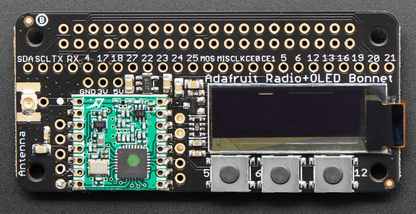

The `rfm69` package provides a Go interface to an SPI-attached
[RFM69HCW module.](http://hoperf.com/modules/rf_transceiver/RFM69HCW.html)

An RFM69HCW module on a convenient breakout board
is [available here](https://www.adafruit.com/products/3070)
[or here.](https://www.sparkfun.com/products/12775)

A Raspberry Pi add-on module with an RFM69HCW, OLED display, and pushbuttons
is [available here.](https://www.adafruit.com/product/4072)

**Note that an antenna must be attached before using these modules.**

The current version supports only OOK modulation (on-off keying)
and a proprietary packet format (variable-length, null-terminated).
Patches to support more general use are welcome.

## Wiring

### Raspberry Pi

The default configuration for ARM CPUs corresponds to
the wiring of the Adafruit RFM69HCW bonnet:

| Function    | GPIO | Header Pin |
| ----------- | ---- | ---------- |
`SPI0 SDO`   | 10   | 19
`SPI0 SDI`   |  9   | 21
`SPI0 SCLK`   | 11   | 23
`SPI0 CE1`    |  7   | 26
`RFM69 DIO0`  | 22   | 15
`RFM69 RESET` | 25   | 22

The SPI configuration corresponds to the Linux `/dev/spidev0.1` device.

### Intel Edison

The default configuration for 386 CPUs assumes the following wiring:

| Function    | GPIO | Mini-Breakout Pin |
| ----------- | ---- | ----------------- |
`SPI5 SDO`   | 115  | J17-12
`SPI5 SDI`   | 114  | J18-11
`SPI5 SCLK`   | 109  | J17-11
`SPI5 CE1`    | 111  | J17-10
`RFM69 DIO0`  |  46  | J19-5
`RFM69 RESET` |  47  | J20-5

The SPI configuration corresponds to the Linux `/dev/spidev5.1` device.
